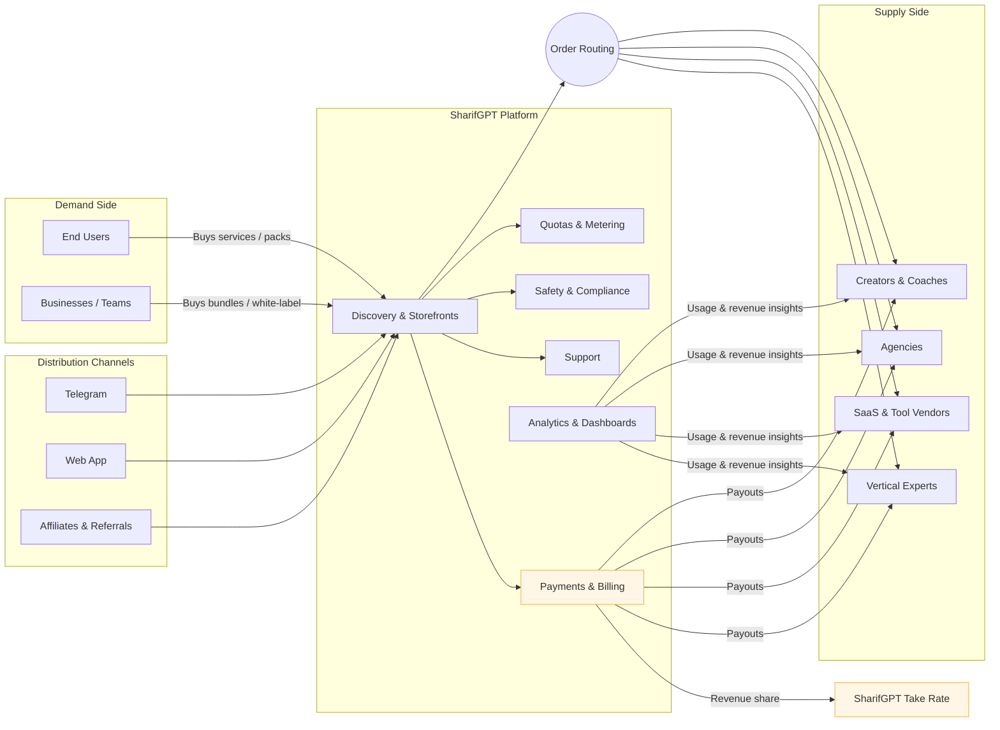

# SharifGPT AI Agent — Business Overview & Partner Platform
_Generated on 2025-11-07 14:01 UTC_

## One‑liner
SharifGPT turns everyday chat into **revenue‑generating services**. Users get a powerful AI assistant; creators and businesses publish their own services on top of it and get paid.

---

## What SharifGPT Is
A **chat‑native AI services platform**:
- For **end users**: a single assistant that transcribes, writes, designs images, summarizes documents, drafts outreach, and more—directly in Telegram today (web coming next).
- For **partners (creators, coaches, agencies, SaaS)**: a place to **launch and monetize** chat workflows without building infrastructure. Publish your service once, we handle access, usage limits, payments, and analytics.

**Vision:** evolve into a **marketplace of AI agents** where third‑party builders list services, set pricing, and reach users immediately.

---

## Customer Value
**Users**
- Convenience: do more from the same chat you already use.
- Speed: voice↔text, document tools, image generation, tailored outreach.
- Fair pricing: subscriptions or usage packs with clear limits.

**Partners**
- Distribution: tap into SharifGPT’s growing user base and our chat channels.
- Monetization: charge per request, per minute, or via bundles/subscriptions.
- Operations done‑for‑you: onboarding, quotas, payments, receipts, refunds, and dashboards—no engineering team required.

**Businesses**
- White‑label options for your community or customer base.
- Standardized checkout, usage tracking, and role‑based access.
- Usage insights to inform pricing and product improvements.

---

## What People Can Do Today
- **Voice → Text**: transcribe voice notes, interviews, lectures.
- **Text → Voice** (beta): create natural audio from text for lessons and promos.
- **Image Generation**: produce banners/thumbnails for posts and ads with safety guards.
- **Docs & OCR**: extract, summarize, translate; export clean results.
- **Outreach & Templates**: find relevant contacts and draft tailored emails/messages.
- **Inline Utilities**: rewrite, translate, TL;DR, coding helpers.
- **Growth Loops**: invite links, in‑chat rewards, and referral programs.

---

## How Partners Use SharifGPT
**Launch your service in 3 steps**
1) **Define your offer**: describe inputs/outputs (e.g., “Podcast transcription with timestamps” or “Writing feedback with rubric”).  
2) **Set pricing & limits**: free trial, subscription, or pay‑per‑use; choose quotas.  
3) **Publish**: get a shareable link and storefront card inside SharifGPT. Users can try, buy, and use instantly in chat.

**Access & Control**
- **No‑code** templates for common services.
- **Low‑code** option to connect your own AI accounts or external tools.
- **Policies & safety** built in to keep services compliant.
- **Analytics**: usage, revenue, retention, top customers.

**Payouts**
- Monthly payouts with a transparent dashboard.
- Clear revenue share; promo codes and partner discounts supported.

---

## Business Model
- **B2C**: subscriptions and usage packs for end users.
- **Marketplace**: revenue share on partner services (listings, bundles, add‑ons).
- **B2B**: white‑label deployments for communities/brands; volume pricing and support SLAs.

**Example Economics**
- Take rate: **10–25%** depending on volume and support tier.
- Average order value (AOV): **$5–$25** per service run (varies by category).
- Conversion drivers: trial → bundle upgrade, creator trackable links, referral credits.

---

## Traction
- Monthly active users: **[15,000]**
- Paying users: **[1,000 / AOV ~ 20$ ]**
- Partner listings live: **[ 0 ]**
- GMV last 30 days: **[21,000 $]**
- Top service categories: **[E-Commerce]**

> We can export these automatically into a live dashboard for investor updates.

---

## Roadmap (Business Outcomes)
- **Open Listings**: self‑serve partner onboarding & storefronts.
- **Bundles**: sell curated service packs (e.g., “Creator Kit” or “Admissions Kit”).
- **Web App**: full parity with Telegram for broader reach.
- **Enterprise & Education**: workspace controls, team seats, consolidated billing.
- **Partner Tools**: coupons, affiliate links, and embeddable “Use with SharifGPT” buttons.
- **Ratings & Reviews**: quality signals to improve discovery and trust.

---

## Differentiation
- **Chat‑first distribution**: remove friction—customers pay and use inside chat.
- **Operational moat**: we standardize payments, limits, refunds, and support so partners focus on value, not plumbing.
- **Multi‑service experience**: users can chain tasks (voice → doc summary → outreach) in one thread.
- **Marketplace flywheel**: more partners → more use cases → more users → higher partner revenue.

---


## Business Architecture (Investor View)




## Ideal Partners
- **Builders of chat-based AIs** that people actually use day to day.
- **Service creators** who deliver clear, repeatable outcomes in chat (e.g., “summarize my doc,” “polish my cover letter,” “make a thumbnail”).
- **Niche experts** who can package their know‑how into a simple chat flow users can buy.
- **SaaS teams** that want a chat front door and instant checkout without rebuilding billing.
- **Communities/creators** who want to offer paid in‑chat tools their audience will love.

## Go‑to‑Market
- **Creator pilots**: co‑branded mini‑apps with rev‑share.
- **Referral programs**: trackable links for partners and micro‑influencers.
- **Community channels**: Telegram and web landing pages with category pages.
- **B2B**: target communities (education, creators, SMB hubs) for white‑label.

---

## What We’re Raising / Use of Funds
- Scale user acquisition and creator partnerships.
- Expand marketplace operations (trust & safety, QA, support).
- Build partner tooling (listings, pricing experiments, analytics upgrades).

---


## 1. Who writes code, or does other technical work on your product? Was any of it done by a non-founder? Please explain.

```
Yes. I hired two contractors: one to build UI/front-end pieces and another to implement specific AI-agent components; I led product discovery, R&D, architecture, and made all technical decisions.
```

## 2. Are you looking for a cofounder?

```
I’m not actively searching for a cofounder; I’m focused on hiring great people. I lead product discovery, R&D, technical decisions, and grew revenue to ~$20K/month—yet if the right person with deep distribution/enterprise GTM shows up, I’m open to a cofounder-equity arrangement.
```

## 3. Company name

SharifGPT

## 4. Describe what your company does in 50 characters or less.

Creates AI that gets stuff done—not just chat

## 5. Company URL, if any

pitch.SharifGPT.com

## 6. Please provide a link to the product, if any.

t.me/sharifgptbot

## 7. What is your company going to make? Please describe your product and what it does or will do.

```
We’re building SharifGPT, an AI that acts, not just chats. Starting on Telegram for distribution—and expanding to web and our own mobile app—the agent completes real-world tasks end-to-end: “Book a table,” “Buy a birthday cake,” “Draft and send this email,” “Schedule a consult,” etc. It handles discovery, options, confirmation, and checkout. For businesses and creators, our no-code Agent Builder connects products/services, configures funnels (webinar → consult → purchase), and automates support inside chat or our app. Under the hood are workflow queues, a minimal session gate (awaiting modes, TTL, cancel/override), commerce primitives (products, carts, orders), and payments. Most AI stops at answers; we deliver outcomes—and we’re already processing ~$20K/month GMV.
```

## 8. Where do you live now, and where would the company be based after investors?

Dubai, UAE / Toronto, Canada / Bay Area, USA

## 9. Explain your decision regarding location.

```
I’m in Dubai now for early MENA traction and proximity/time-zone alignment with our remote team (most teammates are in Iran). My Canadian visa is in process; once issued I’ll relocate to Toronto as our North America base (talent, payments, hiring). After landing, I’ll apply for a U.S. visa to spend significant time in the Bay Area during investors and for partner/fundraising meetings. We’ll keep a lean Dubai presence for MENA sales/support while operating remote-first.
```

## 10. How far along are you?

```
Live MVP: Action agent running in chat (Telegram first; web/native app next). Users can order, book, pay/schedule, and get support—not just chat.

Traction: ~$20K/month GMV from real customers; repeat usage via referral/webinar funnels.

Infra in prod: chat adapter + session gate (awaiting/TTL/cancel), workflow queues, commerce primitives (products, carts, orders), basic payments, referral tracking.

Utilities live that pull users in: voice→text (STT), OCR (image→text), image generation, TTS, email/send, price/news alerts.

Next 3–6 months: self-serve Agent Builder for creators/SMBs, expand payments/partners, launch web + mobile app.
```

## 11. How long have each of you been working on this? How much of that has been full-time? Please explain.

```
Founder (me): started late 2023 (R&D + prototypes), full-time since October 2023; I own product discovery, architecture, and technical decisions.
```

## 12. What tech stack are you using, or planning to use, to build this product? Include AI models and AI coding tools you use.

```
Runtime & infra: Cloudflare Workers; Durable Objects (session/state); KV (config/sessions/referrals); Queues (workflows); R2 (media).
Backend (commerce): MedusaJS (Node/TypeScript) for products/carts/orders with webhooks into Workers.
Front-end: Next.js/React on Vercel (chat-first UI; native app planned).
Messaging: Telegram Bot API (current distro) + email (SMTP/API).
Payments: live basic checkout; expanding to Stripe + regional gateways.
AI: LLM: GPT-class (planning/routing/UX copy). STT: Whisper-class via vendor-agnostic adapter. TTS: ElevenLabs-class via adapter. OCR/vision: cloud OCR endpoints. Image gen: model-agnostic endpoint.
Dev tooling: TypeScript end-to-end, Wrangler, JSON routebooks, idempotent queue messages, lightweight SOPs for repeatable deploys.

This is written by chatgpt but I know all of the in details
```

## 13. Are people using your product?

Yes

## 14. Yes

Yes

## 15. How many active users or customers do you have? How many are paying? Who is paying you the most, and how much do they pay you?

```
Total GMV: $40,288.33

Average order value (AOV): $21.40

Average profit per sale: $9.99

Total profit: $18,809.68

Top customer total spend: $527.19

Largest profit on a single sale: $72.48

Total loss across 9 negative orders: −$62.90
```

## 16. Do you have revenue?

Yes

## 17. Yes

Yes

## 18. Where does your revenue come from? If your revenue comes from multiple sources (e.g., multiple products, multiple companies or a mix of consulting and this product), please break down how much is coming from each source.

```
Today 100% of revenue comes from our e-commerce wedge (digital subscriptions/credits and a small amount of course sales). We haven’t monetized the action agent yet—e-commerce is just our traction channel.

Current revenue:

GMV: $40,288 | Profit: $18,810 | Margin: ~46.7%

Orders: 1,883 | AOV: $21.40

Top customer spend (period): $527 | Largest single-sale profit: $72

Breakdown by source (profit):

Digital subscriptions & credits: $10,212 (~54% of profit)

Other digital SKUs/services (long tail): $8,335 (~44%)

Courses/education: $262 (~1–2%)
```

## 19. Anything else you would like us to know regarding your revenue or growth rate?

```
Future revenue model (not live yet):

SaaS plans: Commerce $49 / $149; Creator $29 / $79 per month.

Performance take-rate: Commerce 1–2% per paid order; Creator 3–5% on digital sales/bookings.

Usage overage: $1 per +1,000 events (AI actions).

Marketplace rev-share: 70/30 (developers keep 70%).

Enterprise add-ons: SLA, SSO, private gateways, data residency.

Positioning:
E-commerce revenue was a deliberate wedge to acquire users and validate demand; we don’t plan to rely on e-commerce long-term. The core business is the action agent with SaaS + take-rate + usage + marketplace + enterprise.
```

## 20. If you are applying with the same idea as a previous batch, did anything change? If you applied with a different idea, why did you pivot and what did you learn from the last idea?

```
First-time applicant. We deliberately waited because our agent relies on lots of cheap, low-latency “micro-inferences,” and until recently model costs made the unit economics upside-down. Over the last year, cost-efficient models and better adapters made sub-cent pricing per 1,000 events feasible—so the idea is now viable. In the meantime we built the rails (session gate, workflows, payments) and validated demand with an e-commerce wedge (~$40k GMV over ~10 weeks, ~$20k/month run rate).
What we learned: ship a paying wedge first, design workflows to minimize model calls, keep the stack vendor-agnostic, and be platform-agnostic (Telegram as a beachhead, own app next).
```

## 21. If you have already participated or committed to participate in an incubator, "accelerator" or "pre-accelerator" program, please tell us about it.

```
No—we haven’t participated in or committed to any incubator/accelerator/pre-accelerator. The company is fully bootstrapped and revenue-funded (≈$20K/month GMV); investors would be our first and only program.
```

## 22. Why did you pick this idea to work on? Do you have domain expertise in this area? How do you know people need what you're making?

```
I’m tired of app-hopping and country-by-country rules just to do basic things. New city, new language, new platform… and I’m stuck re-creating accounts to order dinner or book a place. I want to say what I need and have it done—anywhere: order food in Germany, book a flat in China, schedule a consult in Canada. One action layer, no switching. Language in, job done.

I built the stack end-to-end: a chat adapter with a minimal session gate (awaiting/TTL/cancel), workflow queues, commerce primitives (products/carts/orders), and payments. I shipped a live chat-commerce wedge and grew it to about $20K GMV/month, owning product discovery, architecture, GTM, and remote hiring.

Proof people want it

Real usage beats opinions: in ~10 weeks we processed 1,883 paid orders at ~46.7% margin, with repeat buyers and strong conversion from simple chat funnels. Users consistently prefer “tell it → it’s done” over app-hopping, and creators/SMBs keep asking for a no-code way to sell and support inside chat. E-commerce is our wedge; the same from-chat-to-done engine now powers the broader action agent—a practical step toward AI that can act, not just talk.
```

## 23. Who are your competitors? What do you understand about your business that they don't?

```
Competitors / Platform Risk

Platform giants turning chat into an “app store.” If they fully incentivize third-party actions, they can compress margins and own distribution—this could crush standalone agents.

Commerce suites adding chat flows (checkout, bookings) and super-apps with mini-apps.

Bot builders/automation agencies that ship one-off order/booking bots.

What we understand—and how we win anyway

Partner, don’t duel. We aim to be the fulfillment rail under the big assistants’ intent layers. Strategy: publish action schemas, list in their marketplaces, offer rev-share, and provide SLAs so they prefer to route “do it” tasks to us.

Supply > UX. The hard part is merchant/supplier onboarding (catalogs, payouts, refunds, support). We have the playbook in MENA social commerce (Telegram funnels, local gateways, cashflow quirks). Big assistants won’t build this depth market-by-market.

Operational moat. We own the messy last mile: order state, exceptions, human-in-the-loop, refunds, KYC/settlement. That’s defensible and partner-friendly; platforms don’t want these obligations.

Economics at scale. Our workflows are designed for cheap micro-inferences (caching, batching, vendor-agnostic adapters). We can profit on sub-cent events; many competitors carry a latency/cost tax.

Switching costs accrue on the supply side. Once merchants run catalog, CRM, settlement history, and support tickets through us, multi-homing is costly. This “army of micro-stores” is our moat—and a value-add to any assistant that routes to us.

Multi-channel hedge. Telegram is our beachhead; we’re shipping web + our own app so if a platform changes rules, we retain the customer graph and continue fulfillment.

Niche depth beats broad shallow. We win underserved verticals (regional services, creator bookings, micro-retail) the giants won’t prioritize—then aggregate them behind one action layer.
```

## 24. How do or will you make money? How much could you make?

```
Today (wedge): 100% of revenue comes from our e-commerce operations. In the last ~10 weeks we processed $40,288 GMV across 1,883 paid orders, with $18,810 profit (~46.7% margin). This was a deliberate traction wedge; we don’t plan to rely on it long-term.


step-by-step rollout: what we launch → how we monetize at each step.

Launch: Action Agent v1 (chat → checkout)

Core flows: order/book/pay/schedule, receipts, refunds, basic dashboards.

Monetize now: Performance take-rate only

Commerce: 1–2% per paid order

Creator: 3–5% on digital sales/bookings

KPI gate to Step 2: ≥100 active sellers, ≥$100k monthly GMV, repeat usage.

Launch: Creator & Commerce Plans (SaaS)

Features: custom branding, analytics, catalogs, CRM inbox, basic automations, team seats.

Monetize now: SaaS plans

Commerce: $49 / $149 monthly

Creator: $29 / $79 monthly

Policy: free tier to X orders/month; above threshold prompts plan upgrade. Take-rate from Step 1 continues.

Launch: Usage Metering (“events”)

Define “events”: AI actions (intent parse, tool call, STT, OCR, TTS, routing, etc.).

Include monthly event quota per plan (e.g., 50k / 250k / 1M).

Monetize now: Usage overage = $1 per +1,000 events beyond plan quota.

KPI gate to Step 4: <10% accounts hitting throttles, gross margin >70% on AI ops.

Launch: Marketplace (plugins & templates)

Ship SDK + template store (bookings, invoicing, POS, support macros, niche verticals).

Monetize now: 70/30 rev-share (devs keep 70%).

Flywheel: incentivize devs with spotlight badges, featured placements, credits.

Launch: Enterprise Add-ons

Add SSO/SLA, private model gateways, dedicated data residency, audit logs.

Monetize now: Enterprise add-ons (contracted: annual pricing + implementation fee).

Target: agencies, multi-brand retailers, marketplaces.


How much could you make? (analysis made by chatgpt but I inspect it thoroughly and I think is closest thing to reality) 

Today (baseline wedge)

Current wedge: 100% e-commerce.

Recent 10-week run: $40.3k GMV, $18.8k profit, 1,883 orders, AOV $21.4 (≈ $17–20k GMV/month).

This validates demand and gives us the seller + buyer graph to monetize with the action-agent.


Monetization levers (for the action-agent)

Revenue = SaaS (plans) + Take-rate (on GMV) + Usage (events over quota) + Marketplace (70/30) + Enterprise (SSO/SLA/etc).

Assumptions (month-12, USD)

Active sellers: 80 commerce (C), 50 creator (K)

Avg GMV/merchant/mo: C = $3,000; K = $800

Take-rate on GMV: C = 3%, K = 5%

SaaS ARPU: C = $25; K = $15

MAU: 1,000,000; 45% enter sell/support flows; 4 actions/user/mo; 6 events/action → 10.8M events/mo
(Quotas: Starter 25k, Pro 100k; $1 per 1,000 events over quota; top 10% accounts handle 90% of events)

Marketplace net: $500/mo

Self-operated e-commerce: $90,000 GMV/mo (tripled) at 46.7% margin → profit only

Resold services (tickets/utilities/AI credits/virtual numbers) net: $3,200/mo

Ads/Promoted placements: $3,200/mo

Where we earn money (month-12)

Take-rate (our fee on third-party GMV)

Commerce: 80 × $3,000 × 3% = $7,200

Creator: 50 × $800 × 5% = $2,000
→ Take-rate = $9,200 / mo

SaaS plans (subscriptions)

Commerce: 80 × $25 = $2,000

Creator: 50 × $15 = $750
→ SaaS = $2,750 / mo

Usage overage (metered AI events)

Total events: 10.8M/mo

Top 10% of 130 accts (13) handle 90% = 9.72M (~747,692/acct)

10 Pro: (747,692−100,000)/1,000 = $647.69 each → $6,476.9

3 Starter: (747,692−25,000)/1,000 = $722.69 each → $2,168.1

Remaining 117 accts under quota → $0
→ Usage ≈ $8,645 / mo

Marketplace revenue share → $500 / mo

Self-operated e-commerce (our own store) — profit

$90,000 GMV × 46.7% = $42,030 / mo
(We do not charge a take-rate on our own sales; we count profit only.)

Resold services (net) → $3,200 / mo

Ads / Promoted placements → $3,200 / mo

Final earnings (month-12, with 1M users)

**$9,200 (Take-rate)

$2,750 (SaaS)

$8,645 (Usage)

$500 (Marketplace)

$42,030 (Self-ops profit)

$3,200 (Resell)

$3,200 (Ads)
= $69,525 per month ⇒ ≈ $834,300 ARR.**

Why this grows with more users

Usage scales ~linearly with MAU × billable share × actions (after plan quotas): at today’s ratios, each additional 1M MAU adds ≈ +$8.6k/mo in usage overage.

Resell scales with MAU via tiny conversion rates on many utilities: at current mix, each extra 1M MAU ≈ +$3.2k/mo net (and likely more as catalog expands).

Ads scale with active sellers and traffic: keeping today’s budgets/proportions, each extra 1M MAU can justify another ≈ +$3.2k/mo.

Take-rate & SaaS grow with more active sellers and higher GMV/merchant, which MAU helps unlock over time (more demand → more sellers onboarded).

Self-ops profit grows with your own catalog/reach; you already tripled GMV here—extending offers or ad spend lifts it further one-for-one with margin.
```

## 25. If you had any other ideas you considered applying with, please list them. One may be something we've been waiting for. Often when we fund people it's to do something they list here and not in the main application.

```
AI-Agent Router — intent routing with fast-lane rules and a routebook JSON.
Creator Bookings-in-Chat — scheduling, deposits, reminders, CRM inbox inside Telegram + web widget.
In-Chat Wallet / Vouchers — stored value, voucher codes, split/settle (light KYC).
Telegram Mini-App Marketplace — plugins/templates catalog inside your ecosystem.
```

## 26. Have you formed ANY legal entity yet?

No

## 27. Yes

No

## 28. If you have not formed the company yet, describe the planned equity ownership breakdown among the founders, employees and any other proposed stockholders. If there are multiple founders, be sure to give the proposed equity ownership of each founder and founder title (e.g. CEO). (This question is as much for you as us.)

```
Amir H. Elmtalab — Founder & CEO: 85% (founder common; 4-year vesting with 1-year cliff; will file 83(b) within 30 days).

Employee Option Pool (unissued): 15% reserved for early hires and advisors (typical grants: founding engineer 0.75–2%, designer/growth 0.3–1%, advisors ≤0.25%).

Other stockholders: 0% at formation. Contractors are cash-only. We expect to raise via post-money SAFEs and a later Seed; any investor ownership will be created then (pool may be topped up at Seed if required).
```

## 29. Have you taken any investment yet?

No

## 30. Yes

No

## 31. Are you currently fundraising?

No

## 32. Yes

No

## 33. What convinced you to apply to investors? Did someone encourage you to apply? Have you been to any investors events?

```
I applied because investors is the fastest path to make our action agent real at scale—product discipline, speed, and the network to partner with platform assistants (e.g., integrate as the execution/fulfillment layer inside major chats rather than competing with them). Sam Altman’s “build what users want” ethos and the push toward agents convinced me that the right strategy is to plug into ChatGPT-style platforms and finish the last mile.

No one specifically recruited me. I haven’t been to investors events in person, but I’ve followed investors content for years. The timing now is right: model costs and our traction make the idea viable, and investors’s guidance + partner intros can meaningfully accelerate distribution and partnerships.
```

## 34. How did you meet your early supporters/advisors?

I’ve followed investors content for years and several founder friends recommended applying
---
_This document was adapted from an internal application export and normalized for investors on 2025-11-07 13:37 UTC._
